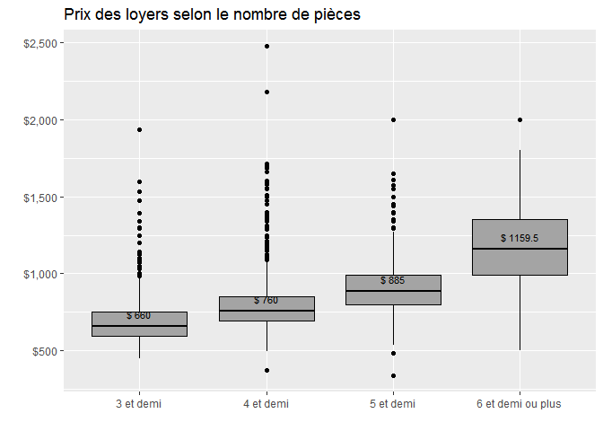
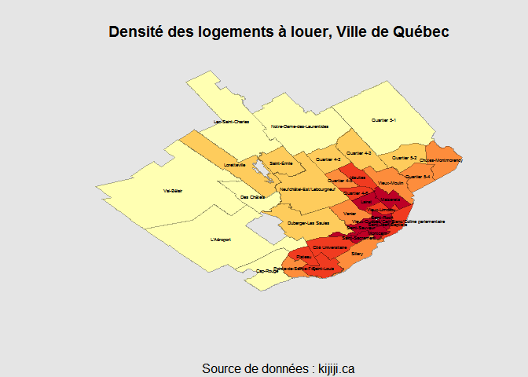
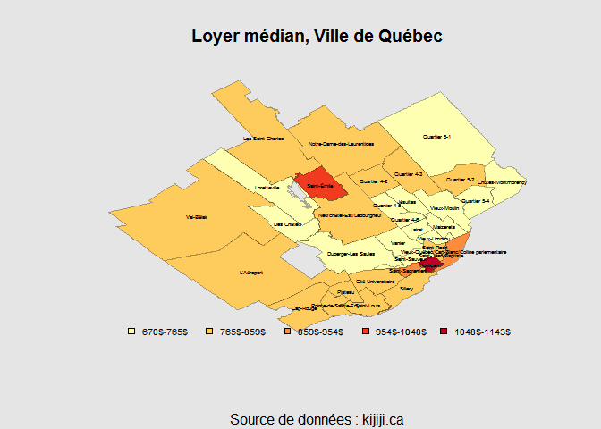
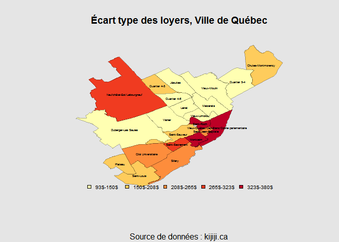

Marché immobilier locatif de la Ville de Québec
================

Avec l'arrivée du beau temps, c'est bientôt la saison du déménagement au Québec. Les annonces de logements à louer apparaissent à tous les coins de rue et surtout sur *kijiji.ca*, site de petites annonces gratuit très populaire au Québec. Les annonces publiées sur ce site constituent une excellente source de données pour analyser le marché immobilier locatif de la Ville de Québec.

Pour recueillir l’information sur le prix, le nombre de pièces et l'adresse des logements à louer depuis *kijiji*, j'utilise **Scrapy**, un module de web scraping en **Python**. Les données analysées ici proviennent des annonces qui apparaissaient le 13 mai 2017 sur les 20 premières pages de la section *location des appartements et des condos* de *kijiji*. J'utilise ensuite **R** pour la visualisation cartographique de ces données. Les polygones des quartiers de la Ville de Québec utilisées ici sont disponibles sur le site [données ouvertes Ville de Québec](http://donnees.ville.quebec.qc.ca/donne_details.aspx?jdid=9). Tous les scripts utilisés pour faire ce post peuvent être retrouvés [ici](https://github.com/chuyachia/kijiji_map).

### Prix des loyers selon le nombre de pièces

La distribution du prix des loyers selon le nombre de pièces est presentée dans le digramme de boîtes à moustaches suivant. Le loyer médian est indiqué au niveau de la barre centrale qui représente la médiane. Sans surprise, le prix tend à augmenter avec le nombre de pièces. On constate que la distribution du prix est oblique à droite. Dans la dernière catégorie, les longues moustaches reflètent l'existence d'une petite quantité de logements qui sont à un prix beaucoup plus élevé que ce qu'on peut attendre d'une distribution normale (les logements de luxe).

### Densité des logements à louer par quartier

La Ville de Québec est divisée en 35 quartiers de superficie et de densité variable. La carte suivante présente la densité des logements à louer dans ces différentes zone. Cette mesure de densité est calculée en effectuant le ratio entre le nombre de logements à louer et la superficie du quartier. Nous constatons que les quartiers du centre-ville sont ceux où il y a le plus grand nombre de logements à louer par rapport à leurs superficies (Notons également que ces quartiers sont aussi généralement les plus petits). Ainsi, le quartier où il existe la plus grande concentration de logements à louer est *Saint-Jean-Baptiste*, suivi par *Saint-Sacrement*, *Lairet*, *Montcalm* et *Saint-Sauveur*.

### Loyer médian par quartier

Une comparaison du loyer médian nous montre clairement la disparité entre les quartiers. Ceux qui habitent depuis un certain temps à Québec ne seront pas étonnés de voir que *Montcalm* est le quartier le plus cher de la ville (avec un loyer médian de $1142). Le deuxième quartier le plus cher de la ville, curieusement, est *Saint-Émile* (loyer médian $985), un quartier plutôt éloigné du centre. Notons cependant que nous disposons peu d'observations pour ce quartier (nous avons seulement 13 observations pour *Saint-Émile* alors que le nombre moyen d'observations par quartier est de 44) et que la plupart de logements dans ce quartier sont plus grands (5 et demi) que ceux que nous trouvons au centre-ville (3 et demi ou 4 et demi). 

Parmis les autres quartiers les plus dispendieux de la ville on compte: *Vieux-Québec/Cap-Blanc/Colline parlementaire* ($892), *Saint-Sacrement* ($870) et *Cité Universitaire* ($850). De l'autre côté, parmi les quartiers les moins chers, nous trouvons *Vieux-Moulin* ($670), *Chutes-Montmorency* ($685), *Lairet* ($690), *Maizerets* ($695) et *Saint-Sauveur* ($695). La séparation entre la Haute-Ville et la Basse-Ville se reflète nettement dans la valeur des loyers. *Montcalm*, en Haute-ville, est ainsi l'un des quartier les plus riches de la ville, alors que son voisin du nord, *Saint-Sauver*, sityé en Basse-Ville est l'un des quartier les moins chers. La frontière entre ces deux quartiers étant principalement matérialisé le relief.

### Écart type des loyers par quartier

En plus des disparités entre les quartiers, les différences au sein des quartiers eux-même peuvent également nous en dire beaucoup sur le marché immobilier locatif. Ici, nous nous concentrons sur les quartiers pour lesquels nous avons plus que 30 observations. La carte suivante présente l'écart type des loyers dans ces quartiers. Ainsi, le secteur où le prix du loyer varie le plus est *Saint-Roch*. Ce résultat me paraît particulièrement intéressant dans le contexte où la gentrification de cet ancien quartier populaire est largement commentée depuis quelques années. 

Derrière *Saint-Roch*, *Vieux-Québec/Cap-Blanc/Colline parlementaire*, *Montcalm*, *Saint-Sacrement* et *Neufchâtel-Est/Lebourgneuf* sont tous les quartiers où nous trouvons une grande variation du prix des loyers. Sans rentrer dans les détails, plusieurs hypothèses peuvent être dresser pour ces zones. Avec les bâtiments historiques du Vieux-Québec et ceux plus modernes de la Colline parlementaire, le quartier de Vieux-Québec/Cap-Blanc/Colline parlementaire* est sans doute l'un des plus hétérogène de la ville.
